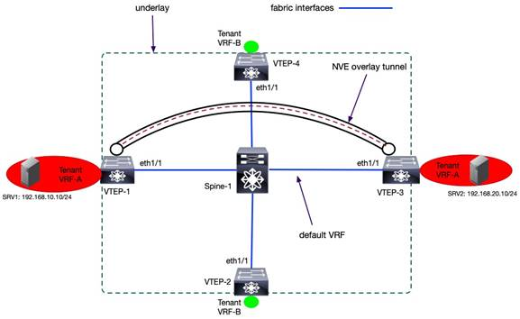

# Tenant Routed Multicast in Cisco Nexus 9000 VXLAN BGP EVPN Data Center Fabrics - Fundamental Concepts and Architectures

Tenant Routed Multicast in Cisco Nexus 9000 VXLAN BGP EVPN Data Center Fabrics - Fundamental Concepts and Architectures
=======================================================================================================================

Options

*   [
    
    PDF](/c/en/us/td/docs/dcn/whitepapers/tenant-routed-multicast-in-nexus9000-vxlan-bgp-evpn-fabrics.pdf) (3.2 MB)  
    View with Adobe Reader on a variety of devices
    

Updated:November 22, 2023

#### Table of Contents

*   [What you will learn?](#Whatyouwilllearn "Whatyouwilllearn")
*   [Multicast Routing Fundamentals](#MulticastRoutingFundamentals "MulticastRoutingFundamentals")
    *   [The Need for Multicast Routing](#TheNeedforMulticastRouting "TheNeedforMulticastRouting")
    *   [Internet Group Management Protocol (IGMP)](#InternetGroupManagementProtocolIGMP "InternetGroupManagementProtocolIGMP")
    *   [Protocol Independent Multicast (PIM)](#ProtocolIndependentMulticastPIM "ProtocolIndependentMulticastPIM")
*   [Multicast Routing in VXLAN BGP EVPN Fabrics Without Tenant Routed Multicast](#MulticastRoutinginVXLANBGPEVPNFabricsWithoutTenantRoutedMulticast "MulticastRoutinginVXLANBGPEVPNFabricsWithoutTenantRoutedMulticast")
    *   [Multicast in the Underlay](#MulticastintheUnderlay "MulticastintheUnderlay")
    *   [Intra-Subnet Multicast in the Overlay](#IntraSubnetMulticastintheOverlay "IntraSubnetMulticastintheOverlay")
    *   [IGMP Snooping in VXLAN BGP EVPN Fabrics](#IGMPSnoopinginVXLANBGPEVPNFabrics "IGMPSnoopinginVXLANBGPEVPNFabrics")
    *   [Multicast Routing with External PIM Routers](#MulticastRoutingwithExternalPIMRouters "MulticastRoutingwithExternalPIMRouters")
    *   [VXLAN Multicast Routing – Router on Stick](#VXLANMulticastRoutingRouteronStick "VXLANMulticastRoutingRouteronStick")
*   [Introduction to BGP/MPLS Multicast VPNs (MVPN)](#IntroductiontoBGPMPLSMulticastVPNsMVPN "IntroductiontoBGPMPLSMulticastVPNsMVPN")
*   [BGP/MPLS MVPN – Draft-Rosen](#BGPMPLSMVPNDraftRosen "BGPMPLSMVPNDraftRosen")
*   [MP-BGP NG-MVPN](#MPBGPNGMVPN "MPBGPNGMVPN")
    *   [Overview](#Overview "Overview")
    *   [Control Plane Function](#ControlPlaneFunction "ControlPlaneFunction")
    *   [Packet Types](#PacketTypes "PacketTypes")
*   [VXLAN EVPN Tenant Routed Multicast Architecture](#VXLANEVPNTenantRoutedMulticastArchitecture "VXLANEVPNTenantRoutedMulticastArchitecture")
    *   [TRM Modes](#TRMModes "TRMModes")
        *   [Layer 3 Mode TRM](#Layer3ModeTRM "Layer3ModeTRM")
        *   [Layer 2/3 Mode TRM](#Layer23ModeTRM "Layer23ModeTRM")
    *   [L3 TRM PIM Rendezvous Point Placement](#L3TRMPIMRendezvousPointPlacement "L3TRMPIMRendezvousPointPlacement")
        *   [Deployment Models](#DeploymentModels "DeploymentModels")
    *   [L3 TRM Multicast Underlay Network](#L3TRMMulticastUnderlayNetwork "L3TRMMulticastUnderlayNetwork")
    *   [L3 TRM Multicast Overlay Network](#L3TRMMulticastOverlayNetwork "L3TRMMulticastOverlayNetwork")
    *   [L3 TRM with Anycast RP Control Plane Operation](#L3TRMwithAnycastRPControlPlaneOperation "L3TRMwithAnycastRPControlPlaneOperation")
    *   [L3 TRM with External RP Control Plane Operation](#L3TRMwithExternalRPControlPlaneOperation "L3TRMwithExternalRPControlPlaneOperation")
*   [Configuring VXLAN EVPN Tenant Routed Multicast](#ConfiguringVXLANEVPNTenantRoutedMulticast "ConfiguringVXLANEVPNTenantRoutedMulticast")
*   [Multi-Site TRM](#MultiSiteTRM "MultiSiteTRM")
*   [Optimized TRM with Data Multicast Distribution Trees](#OptimizedTRMwithDataMulticastDistributionTrees "OptimizedTRMwithDataMulticastDistributionTrees")
*   [Implementing VXLAN EVPN TRM using NDFC](#ImplementingVXLANEVPNTRMusingNDFC "ImplementingVXLANEVPNTRMusingNDFC")
    *   [NDFC Overview](#NDFCOverview "NDFCOverview")
    *   [Deploying TRM using NDFC](#DeployingTRMusingNDFC "DeployingTRMusingNDFC")
*   [Conclusion](#Conclusion "Conclusion")
*   [Legal Information](#LegalInformation "LegalInformation")

 

The documentation set for this product strives to use bias-free language. For the purposes of this documentation set, bias-free is defined as language that does not imply discrimination based on age, disability, gender, racial identity, ethnic identity, sexual orientation, socioeconomic status, and intersectionality. Exceptions may be present in the documentation due to language that is hardcoded in the user interfaces of the product software, language used based on RFP documentation, or language that is used by a referenced third-party product.

What you will learn?

This paper aims to provide education on the fundamentals of multicast routing in VXLAN BGP EVPN fabrics. The two major topics of focus are:

1.     Multicast routing architecture in VXLAN BGP EVPN fabrics, specifically the function and operation of various protocols participating in multicast routing in the underlay and overlay network.

2.     Routed multicast applications in a multi-tenant VXLAN BGP EVPN data center fabric. When multicast applications are routed across networks within a tenant in a VXLAN BGP EVPN fabric, it is called Tenant Routed Multicast (TRM). The network topology addressed in this paper for TRM is for a single VXLAN BGP EVPN data center deployment and also for multiple VXLAN EVPN fabrics part of a Multi-site domain. The fundamentals of the application, architecture, configuration, and troubleshooting of TRM are included and design recommendations are also explained.

Multicast Routing Fundamentals

The following section explains the fundamental concepts of Multicast Routing.

The Need for Multicast Routing

In computer networks, the transfer of packets between network devices is forwarded using unicast, broadcast, or multicast communication. A unicast packet is sent from a single source to a single receiver. In other words, unicast is one-to-one communication. A unicast Internet Protocol (IP) packet will have a source and destination address representing a single device.

Figure 1.  Unicast Communication

Broadcast communication happens when all the nodes in the network receive a packet from a single source. In other words, the broadcast is a one to all communication. A broadcast address in IP communication allows for broadcast communication within networks. The disadvantage of broadcast communication is that all nodes receive the packets even if applications in the node do not require it. The nodes that are interested in receiving the packet are called interested receivers. The interested receiver will process the packets while others will drop the packet at reception.

Figure 2.  Broadcast Communication

Multicast is a one-to-many communication method where only nodes interested in packets receive it. The packet stream going to a group of interested receivers is called a multicast stream and is identified by the destination IP multicast address. Receivers can be cable TV setup boxes that subscribe to channels. Each channel is mapped to a multicast address. Only the channels a receiver wants to view should be streamed to a cable TV setup box.

Figure 3.  Multicast Communication

The advantage of multicast communication is that a single stream of packets is generated from the source and sent into the network, where it is only replicated out of the interfaces where interested receivers exist. Interfaces, where interested receivers do not exist, are pruned from forwarding the multicast stream.

Let’s discuss Ingress replication (IR). IR is a method to perform multicast forwarding. Like multicast communication using IP multicast groups, IR sends packets only to interested receivers using unicast copies of the same packet.

Figure 4.  Ingress Replication

IR consumes more bandwidth as multiple copies of the same packets are forwarded to the network. This may not be an issue if the packet is a small text file or there are few receivers. However, high-definition video with many receivers will multiply the bandwidth consumption on the interfaces on network devices forwarding the replicated packets. Whether to use IR or multicast forwarding for multicast traffic depends on the traffic profile, platform forwarding performance, tenant placement, and the number of receivers.

The most optimal forwarding of multicast packets is achievable when receivers can signal interest in a stream to the network nodes it’s attached to. A distribution tree is constructed in the network that forwards multicast packets between the source and only the interested receivers.

The following section covers these two control plane protocols, Internet Group Management Protocol and Protocol Independent Multicast, that perform these functions.

Internet Group Management Protocol (IGMP)

The IGMP protocol function manages multicast group subscriptions on the last hop router (LHR), also called the querier. The LHR is the router attached to the receivers, while the First Hop Router (FHR) is the router attached to the source of the multicast stream. The LHR sends query messages on each network segment to discover any hosts interested in any or specific multicast group stream. LHR router sends query messages periodically, usually every 60 seconds, to the All-Host multicast group of 224.0.0.1. A host reports interest in a multicast group using the IGMP report message using IGMP reserved multicast group address 224.0.0.22. LHR prunes the forwarding of any multicast stream on any network segment with no interested receivers.

Figure 5.  LHR IGMP Query

Use the “**show ip igmp group vrf** _<vrf-name>_” command to verify membership of any multicast group on an LHR node in a specific Virtual Routing Forwarding (VRF) table.

POD3-DC1-Leaf2# **show ip igmp groups vrf Tenant-1**

IGMP Connected Group Membership for VRF "Tenant-1" - 1 total entries

Type: S - Static, D - Dynamic, L - Local, T - SSM Translated, H - Host Proxy

      \* - Cache Only

Group Address  Type   Interface   Uptime      Expires     Last Reporter

239.1.1.50     D      Vlan22      00:18:17    00:03:10    0.0.0.0

The version of IGMP includes IGMPv1, IGMPv2, and IGMPv3.  IGMPv1 is obsolete. The default and most widely deployed version of IGMP is IGMPv2, as defined in RFC 2236. IGMPv2 improved from IGMPv1 by adding an IGMP message for a host to leave a multicast group. A host uses IGMPv2 to signal the LHR interest in a multicast group.  The LHR then signals using Protocol Independent Multicast (PIM) Any Source Multicast (ASM) to build a multicast distribution tree to stream multicast traffic from the source of the multicast group to the receiver. In IGMPv2, the host does not know the source of the multicast stream. IGMPv3 as defined in RFC 3376, allows a host to signal the source and group combination in the IGMP join message to its LHR to specify which sources the host wants to or does not want to receive the multicast stream from. IGMPv3 works with PIM Source Specific Multicast (SSM) routing protocol to signal multicast distribution trees in the network to interconnect the source and receivers.

IGMP’s function is to identify where the receivers exist in the network receivers. The question remains how do the routers learn of the existence of a source of the multicast stream, and how is the routing information table built on the routers to forward the multicast traffic from the source to a receiver? The PIM protocol has the role of addressing these questions.

Protocol Independent Multicast (PIM)

PIM protocol is a multicast routing protocol that comes in three implementation types:

1.     Any Source Multicast Sparse Mode (PIM-SM)

2.     Any Source Multicast Bidirectional Mode (PIM-Bidir)

3.     Source-Specific Multicast (SSM). 

The types of implementations define the multicast routing topology for the multicast distribution tree. Each implementation of PIM will use a shared tree, source tree, or both to connect the source to the receivers of the multicast stream.

The shared tree has a reference point called the Rendezvous Point (RP) which acts as a root of the multicast distribution tree. The RP is the initial meeting point for the source and receivers of a multicast group. Every multicast router in the network knows about the RP. The RP maintains in its multicast routing information base (MRIB) the path to the source of a multicast group and interested receivers. The path to the source of a multicast group is stored as (S, G) entries in the MRIB. The (S, G) is a state in a router for a specific source S to a multicast group G. The (S, G) is a state that represents a source tree. The RP will maintain entries for all sources that have registered with the RP. The incoming interface list (IIL) in an (S, G) source tree is always toward the source. The outgoing interface list (OIF) is towards the receivers learned through a PIM join or IGMP membership report.

Figure 6.  PIM-SM Shared Tree

The interested receivers send an IGMP Join message to the LHR, where a (\*, G) state is created in the MRIB. The (\*, G) is a state in a router for any source to the specific multicast group. The (\*, G) is a state that represents a shared tree with the RP as its root. The IIF in a shared tree is toward the RP, while the OIF is toward the receiver. In the above diagram, the multicast stream path is from R1 (FHR)->R2->R3 (RP)->R4 (LHR). A more optimal path is available between the source and receiver directly from R1 (FHR) to R4 (LHR). On receiving the multicast stream, the LHR will learn the source IP address of the multicast group and signal the shortest path tree towards the source in the direction of the FHR, forming a source tree. The optimization of the multicast distribution tree is enabled by default in the network running PIM-SM on Cisco routers.

PIM-SM with shared trees is for multicast applications where receivers are not aware of the sources for the multicast stream. The RP has the responsibility of introducing the source to the receivers. If the receiver has information about the source for each multicast group, then using IGMPv3, each receiver can signal its interest to the LHR to receive a multicast stream from a specific source. The LHR no longer needs to signal a (\*, G) PIM join towards the RP but it can signal a (S, G) PIM join towards the FHR  attached to the source.  The LHR learns about the source for the group via the IGMPv3 report message from the attached receivers, as shown in the below output.

LHR# **show ip igmp groups 239.2.2.20 detail**

<snip>

Interface:    GigabitEthernet1/5

Group:        239.2.2.20

Flags:        SSM

Uptime:       3w4d

Group mode:   INCLUDE

Last reporter: 192.168.1.2

<snip>

  Source Address    Uptime    v3 Exp    CSR Exp   Fwd   Flags

  192.168.200.20    1w2d      00:03:08  stopped   Yes   R1

The PIM-SSM protocol learns the source information from IGMPv3 and signals a source tree directly toward the FHR, forming an optimal multicast distribution tree. In PIM-SSM, as information and location of the source are known, there is no requirement for an RP. An (S, G) route entry state is maintained for each multicast group's unique source.

Figure 7.  PIM-SSM Source Tree.

The above diagram depicts two sources S1 and S2 for the same multicast group G. Receiver-1 expresses interest in S1 as the source for the multicast stream, while Receiver-2, for the same group G prefers the source S2.

Multicast Routing in VXLAN BGP EVPN Fabrics Without Tenant Routed Multicast

In VXLAN BGP EVPN fabrics, routing protocols are run in two networking IP address namespaces called the underlay and overlay networks. The underlay consists of edge devices and routing protocols to forward traffic between edge devices. The unicast routing protocol function is to provide reachability between the edge devices. The multicast routing protocol function is to optimally forward Broadcast Unknown Unicast and Multicast (BUM) traffic between edge devices. The underlay routing protocols are enabled in the default routing table or default Virtual Routing Forwarding (VRF) instance. Attached to the devices are tenants represented by non-default VRF and/or VLANs. The VRFs/VLANs attached to the edge devices are part of the overlay network. Tenant systems (TS) is an industry term to refer to any system attached to edge devices in a specific VRF. A network device or a host, such as a server, may attach to the edge device.

Any tenant's unicast and multicast traffic is encapsulated inside a logical VXLAN tunnel that provides both routing and switching in a VXLAN fabric. The tunnel is called a Network Virtualization Edge (NVE) interface on Cisco Nexus 9000 NX-OS switches. The VXLAN interfaces exist on edge devices known as Virtual Tunnel Endpoints (VTEP). The signaling of the overlay tunnel is managed by the overlay control plane protocol. In a VXLAN BGP EVPN fabric, the BGP EVPN is the control plane for signaling the VXLAN tunnel and distributing both layer 2 and layer 3 routing information (host IP, MAC, and IP prefixes) for unicast routing. All the routes distributed via overlay protocols are for tenant systems in the VRFs attached to each edge device. VXLAN tunnels forward traffic between tenant systems members of each VRF over the underlay network. Each VRF in the overlay is identified by a Virtual Network Identifier (VNI).

Figure 8.  VXLAN Routing Architecture

The multicast routing protocols in VXLAN BGP EVPN fabrics exist in the underlay and the overlay. The multicast routing protocol overlay instances run within tenant VRFs attached to the VTEPs interfaces. The underlay instance runs on the fabric interfaces, links between the leaf and spine, which exist in the default VRF.

Multicast in the Underlay

The forwarding of Layer-2 BUM traffic on each VTEP is addressed using ingress replication (IR) or multicast forwarding. A VTEP in ingress replication mode performs the following:

1.     Ingress VTEP device receives BUM packet from a tenant system in a VNI.

2.     Ingress VTEP creates multiple copies of the BUM packet.

3.     Ingress VTEP device sends one packet copy to each remote VTEP where that same VNI is defined.

The key table each VTEP must maintain is the NVE neighbor list per VNI. The maintenance of the NVE neighbor list per VNI can be done statically or dynamically. In the static method, a network administrator manually configures each remote VTEP NVE neighbor per VNI. The below example provides the basic commands to define a VTEP NVE neighbor for VNI 30001 statically.

interface nve1

  source-interface loopback 1

  member vni 30001

    ingress-replication protocol static

    peer-ip 10.3.11.3 

As networks are removed and added according to the movement of workloads in the data center network, the NVE neighbor table has to be updated to ensure the BUM traffic for each VNI is replicated to remote VTEP members of the VNI. Manually updating NVE neighbor tables across all the VTEPs is operationally challenging, and it will create situations when VTEPs receive BUM traffic when not required or VTEPs don’t receive BUM traffic when they should. Dynamic IR uses the BGP EVPN Type 3 – Inclusive Multicast Ethernet Tag Route - to create a list of remote VTEPs for ingress replication. The BGP EVPN Type 3 routes are sent to all remote VTEPs as soon as a VNI is provisioned on a VTEP to signal interest in receiving BUM traffic. The below example provides the basic commands to provision dynamic IR to define a VTEP NVE neighbor for VNI 30001.

interface nve1

  source-interface loopback 1

  member vni 30001

    ingress-replication protocol bgp

The multicast routing instance in the underlay allows optimal forwarding between the VTEPs of BUM traffic received on the tenant interfaces. The multicast protocols supported in the underlay on Nexus 9000 NX-OS switches are PIM ASM Sparse Mode and PIM ASM BiDir. PIM Sparse mode creates one source tree per VTEP per multicast group. PIM BiDir creates one shared tree per multicast group. The RP redundancy mechanism varies between the two flavors of PIM ASM.

The PIM Sparse Mode uses PIM Anycast RP (RFC 4610) for RP redundancy and sharing between multiple RPs. A group of routers called the Anycast-RP set share a common IP address allowing multiple routers to act as RPs for a single multicast group. In a VXLAN fabric, the spines serve as RPs for the underlay. The VTEPs act as a source and receiver for the underlay multicast groups and register themselves as a source to one of the underlay RPs. Each RP with registered sources sync S, G state information using a unique IP address assigned to each RP, providing active/active redundancy. Thus, two loopbacks are required for PIM Anycast-RP on the RPs, one loopback that uniquely identifies each RP and one loopback with the shared anycast IP address.

The topology and sample configuration elaborate PIM configuration on the leaf and spine switches with PIM Anycast-RP.

Figure 9.  PIM Anycast-RP

Spine-1 PIM Anycast-RP Configuration

interface loopback0

 description RID

 ip address 192.168.1.1/32

 ip pim sparse-mode

interface loopback254

 description RP

 ip address 192.168.100.100/32

ip pim rp-address 192.168.100.100 group-list 239.0.0.0/24

ip pim anycast-rp 192.168.100.100 192.168.1.1

ip pim anycast-rp 192.168.100.100 192.168.2.2

**Note:**      Spine-2 will have a similar configuration to Spine-1 as shown above. The Spine-2 will have a unique loopback 0 ip address for the router-id.

Leaf-1 PIM Anycast-RP Configuration

ip pim rp-address 192.168.100.100 group-list 239.0.0.0/24

PIM ASM Bidir uses phantom RP as its RP redundancy mechanism. The phantom RP provides active/standby redundancy. The spines have a dedicated loopback interface for RP addresses with the same IP address but a different subnet mask length. The primary RP will have a longer subnet mask length than the secondary RP for the same multicast group. The RP address specified in all the nodes will be a different IP address in the same subnet as the RP loopbacks of the spines. The RP address is not an IP address applied to any interface.

The topology and sample configuration elaborate on how PIM is configured on the leaf and spine switches with PIM Phantom-RP.

Figure 10.  PIM Phantom-RP

Spine-1 PIM Phantom RP Configuration

interface loopback254

  description RP

  ip address 192.168.100.2/30

  ip pim sparse-mode

interface loopback0

  description RID

  ip address 192.168.1.1/32

  ip pim sparse-mode

ip pim rp-address 192.168.100.1 group-list 239.0.0.0/24 bidir

Spine-2 PIM Phantom RP Configuration

interface loopback254

  description RP

  ip address 192.168.100.2/29

  ip pim sparse-mode

interface loopback0

  description RID

  ip address 192.168.2.2/32

  ip pim sparse-mode

ip pim rp-address 192.168.100.1 group-list 239.0.0.0/24 bidir

Leaf-1 PIM Phantom RP Configuration

ip pim rp-address 192.168.100.1 group-list 239.0.0.0/24 bidir

Intra-Subnet Multicast in the Overlay

Multicast applications can exist in tenant VLANs attached to the VTEPs. The multicast applications are assigned separate multicast group addresses in each VLAN from the underlay multicast group. Every VLAN has networks assigned to unique subnets, and each subnet is mapped to a Layer 2 VNI. Each Layer 2 (L2) VNI has a multicast group in the underlay to handle BUM traffic. The ‘M’ in BUM is the overlay multicast traffic encapsulated inside the underlay multicast group for each L2 VNI. For example, if there is a multicast application in L2 VNI 30000 with subnet 10.1.1.0/24 streaming using the multicast group 228.1.1.50. The multicast application is received on a VTEP leaf-1 with L2VNI 30000 with an underlay multicast group 239.1.1.2. The leaf-1 will encapsulate a VXLAN packet with the inner destination IP address as 228.1.1.50 and the outer destination IP address as 239.1.1.2. Yes, the VTEP is taking IP multicast encapsulating inside IP multicast. The multicast traffic is received by all VTEPs configured with L2VNI 30000. The multicast traffic will remain within the subnet. The configuration example below shows the 1:1 mapping between an L2VNI and the underlay multicast group for an NVE interface.

interface nve1

  no shutdown

  host-reachability protocol bgp

  source-interface loopback1

  member vni 30000

    mcast-group 239.1.1.2

The command “**show nve vni** _<L2 VNI #>_” allows the verification of the underlay multicast group to L2VNI mapping as shown below.

LEAF1# **show nve vni 30000**

Codes: CP - Control Plane        DP - Data Plane         

       UC - Unconfigured         SA - Suppress ARP       

       SU - Suppress Unknown Unicast

       Xconn - Crossconnect     

       MS-IR - Multisite Ingress Replication

Interface VNI      Multicast-group   State  Mode  Type \[BD/VRF\]    Flags

\--------- -------- ----------------- ----- ---- ------------------ -----

nve1      30000    239.1.1.2         Up     CP        L2            \[12\]

Nexus 9000 NX-OS provides the option to map many L2VNI to a single underlay multicast group using the global option as shown in the below example.

interface nve1

  source-interface loopback1

  host-reachability protocol bgp

  global mcast-group 239.0.0.1 L2

  member vni 2001001

  member vni 2001002

  member vni 2001007-2001010

In the above example, any intra-subnet multicast traffic in L2 VNIs 2001001, 2001002, and 2001007 – 2001010 will be encapsulated inside the underlay multicast group 239.0.0.1. The L2 VNI to underlay multicast group models supported are 1:1, N:1, and N:M where N = number of L2VNIs and M = number of underlay multicast groups.

The allocation of underlay multicast groups to L2 VNIs is a balance of efficient bandwidth utilization and multicast route table state maintenance. The bandwidth utilization is determined by the traffic profile of the application and the number of tenant multicast groups in the L2 VNI overlay network. For example, if there are five unique multicast applications with IP address 225.1.1.1 – 5 in L2 VNI 10000 overlay network with underlay multicast group 239.1.1.1. All the five-overlay multicast group traffic are encapsulated in VXLAN with the underlay multicast group 239.1.1.1 for L2 VNI 10000. Suppose the tenant multicast applications do not consume much bandwidth. In that case, allocating multiple L2 VNIs to a common multicast group is an excellent option to prevent the increase of the mroute state in the underlay.

The total number of underlay multicast groups for L2 VNI and L3 VNI is 512, as per the current release of NX-OS 10.3. As more unique underlay multicast groups are allocated for each L2 VNI, it increases the multicast routing table entries in the underlay network. Each underlay multicast group allocated to L2 VNI reduces the number of underlay multicast groups that can be allocated to L3 VNI for TRM. Keep track of the total number of VLANs and VRFs the network can grow to ensure the network operates within the scale limits for underlay multicast groups for a VXLAN BGP EVPN fabric.

The L2 VNIs with a common multicast group for BUM traffic handling traffic path are forwarded in the same PIM MDT underlay. Once the traffic arrives at the destination VTEP, the forwarding is based on the L2 VNI in the header. A unique MAC-VRF table per L2 VNI maps to a VLAN attached to an outbound interface. Traffic segmentation is maintained for end-to-end communication.  Only the remote VTEPs with the L2 VNI attached will receive the BUM traffic.

In a VXLAN BGP EVPN, fabric overlay multicast traffic is bridged if the fabric is not enabled with TRM. Without TRM capability, the fabric requires an external PIM router to connect sources and receivers in different networks.

The L2 VNI is a bridge domain over an IP fabric. Like a layer 2 switch VLAN, any BUM traffic received on a VLAN is flooded to all interfaces forwarding for the same VLAN. In the case of multicast traffic, IGMP snooping in switches assist in delivering multicast traffic out ports with interested receivers or PIM routers attached. IGMP snooping in VXLAN BGP EVPN fabrics provides similar benefits to VTEPs.

IGMP Snooping in VXLAN BGP EVPN Fabrics

A VXLAN BGP EVPN fabric without IGMP snooping enabled will flood overlay multicast traffic to all the remote VTEP members of the same L2VNI using the L2VNI’s underlay multicast group. The multicast forwarding behavior should be analyzed from the location of the source and receivers. The diagram below shows an example fabric with the source and receivers in VLAN 10 subnet attached to VTEP L1 without any remote receivers.

Figure 11.  Multicast Forwarding without IGMP Snooping

The blue arrows above indicate the multicast traffic forwarding within VLAN 10 subnet in the VXLAN overlay. Multicast traffic sourced from S1 is locally switched and received by receiver R1. If another host were attached to L1 in the same VLAN but not interested in the multicast traffic, it would still receive it. L1 will not perform any pruning on the local interface.  The VTEP L1 encapsulates the 239.1.1.1 tenant multicast group traffic into the L2VNI multicast group in the underlay multicast distribution tree. All remote VTEPs receive the multicast traffic with VLAN 10 attached to it even though the remote VTEPs L2, L3, and L4 do not have interested receivers. When L2, L3, and L4 receive the VXLAN encapsulated multicast traffic, each remote VTEP sends the multicast traffic out to all ports assigned to VLAN 10. There is also no pruning on remote VTEPs.

Turning on IGMP snooping for all VXLAN enabled VLAN is done through the global configuration command “**ip igmp snooping vxlan**”. The “**show ip igmp snooping groups**” is a command to verify which VLANs IGMP snooping is enabled on.

LEAF1# **show ip igmp snooping groups**

Type: S - Static, D - Dynamic, R - Router port, F - Fabricpath core port

Vlan  Group Address      Ver  Type          Port        list

12         \*/\*             R                nve1        Vlan12

2000       \*/\*             R                nve1        Vlan2000

**Note:**      Notice how the NVE interface functions as a multicast routed port.

The multicast traffic forwarding behavior in VLAN 10 subnet with IGMP snooping enabled is depicted in the below diagram.

Figure 12.  IGMP Snooping Enabled Multicast Forwarding with local receiver

L1 is the only node with a receiver R1 in VLAN 10. The source S1 is also attached to the L1 node in VLAN 10. In this case, the multicast traffic is only locally switched as there are no receivers on the remote VTEPs L2, L3, and L4. Pruning is available for locally switched and VXLAN traffic because there are no interested receivers on any remote VTEPs. The moment a second receiver, R2, is attached to remote VTEP L3. The VTEP L3 receives an IGMP Join, which is flooded inside the VLAN 10. When enabling IGMP snooping for VXLAN, the NVE interface also functions as a multicast router interface. The NVE interface encapsulates the IGMP join and floods the IGMP join inside the L2 VNI underlay multicast group mapped to VLAN 10. The VTEP L1 receives the IGMP join, triggering the NVE interface on VTEP L1 to program its NVE interface as an OIF for multicast group 239.1.1.1 Multicast traffic is VXLAN encapsulated and forwarded in the L2 VNI multicast group to all remote VTEPs with VLAN 10 provisioned, as shown in the below diagram.

Figure 13.  IGMP Snooping Enabled Multicast Forwarding with remove receiver

Every VTEP with VLAN 10 locally defined becomes a source and a receiver for the underlay multicast group for the L2VNI mapped to VLAN 10. Therefore, L2 and L4 nodes both receive the multicast traffic even though no interested receivers are attached to them. 

The underlay L2 VNI multicast group state information is available in the MRIB table of every VTEP, as shown in the below example.

LEAF1# **show ip mroute 239.1.1.1**

IP Multicast Routing Table for VRF "default"

(\*, 239.1.1.1/32), uptime: 4d04h, nve ip pim

  Incoming interface: Ethernet1/1, RPF nbr: 10.1.1.0

  Outgoing interface list: (count: 1)

    nve1, uptime: 4d04h, nve

(10.1.11.1/32, 239.1.1.1/32), uptime: 4d04h, nve mrib ip pim

  Incoming interface: loopback1, RPF nbr: 10.1.11.1

  Outgoing interface list: (count: 1)

    Ethernet1/1, uptime: 4d04h, pim

(10.1.11.3/32, 239.1.1.1/32), uptime: 4d04h, ip pim mrib

  Incoming interface: Ethernet1/1, RPF nbr: 10.1.1.0

  Outgoing interface list: (count: 1)

    nve1, uptime: 4d04h, mrib

The source address used for L2 VNI multicast group is the VTEP’s NVE source interface address, as shown below.

LEAF1# **show nve interface nve 1**

Interface: nve1, State: Up, encapsulation: VXLAN

 VPC Capability: VPC-VIP-Only \[not-notified\]

 Local Router MAC: ac7a.56fd.040f

 Host Learning Mode: Control-Plane

 Source-Interface: loopback1 (primary: 10.1.11.1, secondary: 0.0.0.0)

Notice that the NVE source-interface loopback 1 IP address matches the above source address in the (S,G) entry MRIB table for multicast group 239.1.1.1/32.

Multicast traffic in a VXLAN fabric is treated as a BUM packet by default, which results in multicast traffic communication between source and receivers within the same subnet only. If the source and receivers are in different subnets, we need multicast routing capability to connect sources and receivers in the tenant VRFs.

The two architectures available to support multicast routing in VXLAN BGP EVPN fabrics are:

1.     External PIM router or Multicast Routing on a Stick

2.     Tenant Routed Multicast

The following section elaborates on achieving multicast routing using an external router.

Multicast Routing with External PIM Routers

In earlier days of ethernet networking, when switches were first introduced as the next generation of bridges, the first form of network segmentation was introduced, VLANs. VLANs were a single broadcast domain at the second layer of the OSI model. The layer 2 switches forward ethernet frames based on the MAC address. Inter-subnet unicast routing depended on an external router attached to the layer 2 switch to switch traffic between subnets. This architecture is commonly known as Router-on-a-Stick.

The layer 2 switch attaches to a router using a trunk port. The router has a single physical interface logically segmented into multiple sub-interfaces called dot1q sub-interface. Each dot1q sub-interface can process tagged traffic for a specific VLAN and acts as a gateway for the subnet assigned to the VLAN.

Figure 14.  Unicast Routing – Router on Stick

The comparison between router-on-a-stick for unicast and multicast routing is very similar. The VXLAN fabric now acts like one logical switch with source and receivers attached to it. The external PIM router connects to this logical switch and routes the multicast traffic between the VLAN subnets.

An external PIM router allows inter-subnet multicast routing in a VXLAN BGP EVPN fabric with VTEPs that cannot route multicast traffic.

VXLAN Multicast Routing – Router on Stick

The non-TRM-capable VTEPs floods all multicast traffic within the broadcast domain. Therefore, an external router must act as the multicast routing device, which performs the multicast forwarding allowing connectivity between sources and receivers in different subnets in a VXLAN BGP EVPN fabric.

The external PIM router acts as an RP if PIM ASM is configured for routing multicast. Any source within the VXLAN fabric registers for the external PIM RP router. PIM SSM does not require an RP node. The VTEPs with the host attached has anycast gateway IPs configured for every subnet. The external PIM router attaches to a VTEP via a dot1q interface with sub-interfaces for each VLAN. The VLANs are mapped to L2VNIs which have BUM underlay multicast groups assigned to them.  The VTEP L2 with the attached external PIM router can have a PIM neighbor relationship using SVI-based routing. The PIM protocol is enabled between VTEP L2 and the external PIM router to signal the multicast distribution tree to connect sources and receivers within the fabric across networks.  The external PIM router receives IGMP joins on the VLANs attached to the receiver and sends out PIM joins to the VLANs with the source. All multicast signaling from nodes within the fabric and external PIM router is flooded using the underlay multicast group for each VLAN. The VTEP L2 will attach to the external PIM router using a trunk interface to allow all VLAN traffic toward the external PIM router.

The multicast traffic arriving on L1 from source S1 is VXLAN encapsulated using the underlay L2 VNI multicast group and sent to all remote VTEPs with VLAN 10 L2 VNI deployed. The VTEP L2 will receive the multicast stream and forward it out the trunk interface in VLAN 10 attached to the external PIM router. The receiver R1 in VLAN 20 sends an IGMP join which gets flooded inside L2 VNI underlay multicast group mapped to VLAN 20.  The VTEP L2 receives the IGMP Join as it has a dot1q sub-interface in VLAN 20 and allows the external PIM router to learn about an interested receiver in VLAN 20. The PIM router takes the multicast stream received in VLAN 10 sub-interface and forwards the multicast stream out dot1q interface for VLAN 20. The VTEP L2 receives the multicast stream tagged with VLAN 20 from the external PIM router and re-encapsulates it as a VXLAN packet using the underlay L2 VNI multicast group address for the L2 VNI mapped to VLAN 20. All VTEPs that have locally deployed that L2 VNI receive the multicast traffic.

A significant caveat with multicast routing using a router-on-a-stick approach is that the same multicast stream is flooded within the source and destination bridge domain(s). The multicast stream is treated as BUM traffic when received on VLAN 10, where the source resides, and on the destination subnet VLAN. As the number of VLANs increases, copies will multiply as each VLAN maps to a unique L2 VNI with its L2 VNI multicast group to handle BUM traffic. The traffic path is also sub-optimal as all multicast traffic has an extra hop to traverse outside the fabric through the external PIM router and then return to the fabric to reach the destination subnet. The traffic path in a 3-stage CLOS Fabric should be a single hop between two endpoints. The benefit of multicast is to reduce duplication of traffic in the network. The ideal solution should provide an optimal traffic path and use a single copy of multicast traffic routed between source and receivers, regardless of how many networks with receivers are attached to remote VTEPs. The TRM feature will address the caveats of using an external PIM router and allow VTEPs to signal and forward multicast traffic directly between sources and receivers in the VXLAN fabric.

Introduction to BGP/MPLS Multicast VPNs (MVPN)

**Note:**      The purpose of the sections on BGP/MPLS Multicast VPNs (mVPNs) is to provide background on the service provider technologies and concepts from which VXLAN BGP EVPN Tenant Routed Multicast has borrowed from and ported over for the modern data center fabric. The intention is not to dive deep into BGP/MPLS MVPNs; that is not the focus of this white paper. The architectures, definitions, and concepts are consistent between MPLS and VXLAN BGP EVPN networks.

BGP/MPLS Layer 3 VPNs gained popularity in connecting enterprise sites through a shared service provider infrastructure. The solution initially started as a connectivity option for unicast routing. Still, as multicast applications such as collaboration, video streaming, and multimedia increased in usage across enterprise sites, demand grew to support multicast applications across L3 VPN sites. There are two ways to implement multicast VPNS in MPLS networks:

1.     Draft-Rosen or Dual PIM MVPNs or BGP/MPLS MVPN.

2.     BGP/MPLS NG-MVPN

Both solutions achieve the same end goal: route multicast packets within a VPN across sites through a shared infrastructure. A few basic terminologies that are common to both multicast VPN solutions need to be defined.

Figure 15.  Multicast Domains in MPLS VPNs

**Multicast Domain**: A group of BGP/MPLS VPNs sites assigned to the same VRF with multicast connectivity allowing multicast traffic between the sites.

**Multicast VPN(MVPN)**: A VRF that can route unicast and multicast routing.

**Multicast Distribution Trees (MDT)**: A forwarding tree built to carry customer multicast traffic between edge routers connected to common VRFs in the same Multicast Domain.

What differentiates one solution from the other is the way the MDT is signaled in the control plane, and multicast packets are forwarded in the data plane. There are two types of MDTs:

**Inclusive Trees**: A single MDT that carries all multicast traffic in an MVPN. Commonly known as Default-MDT.

**Selective Trees**: An MDT that carries traffic for a specific or a set of multicast groups within an MVPN. Commonly known as Data-MDT.

The types of multicast trees across the two multicast VPN solutions have a common function, but how the trees are signaled in the control plane and how multicast packets are forwarded in the data plane are different. The purpose of both types of trees is the same, and the same fundamental definitions apply to both solutions. The following section will explain the specific attributes of each type of tree for each solution.

BGP/MPLS MVPN – Draft-Rosen

In Draft-Rosen, each multicast domain is represented by a unique multicast group in the service provider's backbone network, which is called the provider multicast group or, for short, the P-Group address. The relationship between MVPN to the P-Group is shown below:

VRF with Multicast --> MVPN --> Multicast Domain --> P-Group

The P-Group is only known in the backbone core routing devices. The multicast traffic from each site is sent using the customer multicast group or C-Group. The customer C-Group packets are encapsulated at the PE routers inside a P-Group packet and sent across the backbone network on the MDT tree. Essentially encapsulating customer multicast traffic inside another multicast tunnel interface (MTI)—these multicast tunnel interface stretches between the PE routers for each MVPN. The Generic Routing Encapsulation (GRE) protocol creates the multicast tunnel interface.

The protocol that is used to signal the distribution trees is PIM. PIM Protocol maintains PIM adjacency between the customer edge routers (CE) and Provider Edge (PE) routers. PIM adjacency is also set up between all the PEs that are members of the same MVPNs to reach VRF. PIM is used to carry customer multicast information from the CE to PE across the SP network to remote PEs in the same MVPN using the MDT. The MDT used to send control plane traffic by default is the Default MDT. The Default-MDT is also used by default to send all traffic within a specific threshold packet rate inside an MVPN. The PE routers build a Default-MDT to peer with remote PE routers in the same MVPN. The Default-MDT group address is part of the P-Group address pool managed by the service provider.

The RP for the Default-MDT group address is in the provider network. When a Default-MDT group is created from the P-Group address pool, every PE router peer PIM across the MTI. Every PE router having PIM adjacency across the MTI in a particular MVPN becomes both a source and receiver for the Default-MDT group. The core routers must maintain Default-MDT per PE and MVPN. All PE routers of the same MVPN receive traffic on the Default-MDT even if no receivers are attached, making it an inclusive multicast distribution tree.

Suppose a particular source within an MVPN sends multicast traffic exceeding a particular threshold packet rate and has a subset of remote sites with subscribers. In that case, the Data-MDT is then used to forward traffic to the subscribers if configured. The Data-MDT avoids flooding multicast traffic to remote sites that do not have subscribers to C-group in an MVPN. Since Data-MDT only sends traffic to remote PEs with attached subscribers, it is a selective multicast distribution tree.

The drawback of Draft-Rosen is the control plane overhead primarily from the maintenance of PIM adjacency. If N = #VPNs and M = #PEs. The total adjacency maintained on a single PE router is equal to MxN.

Providers must maintain a different protocol (PIM) in the core for multicast traffic. PIM adjacency maintenance via hello packets between CE and PE routers and between PE routers on the MTI for every VRF increases control plane packets and state. The service provider must configure extra PIM instances in the core network for P-Groups for building MDT in the core for encapsulating and forwarding C-Group packets. As the number of Default-MDT and Data-MDT groups increases, the multicast state in the core increases.

NG-MVPN helped address the limitations of Draft-Rosen by simplifying the control and data planes. The following section provides a primer on NG-MVPNs. The BGP NLRI for carrying C-multicast routes across the core network is MCAST-MVPN (SAFI = 5).

MP-BGP NG-MVPN

Overview

Draft-Rosen, explained in the previous section, built another parallel overlay using GRE tunnels on top of the MPLS network between the edge and core routers. The GRE tunnel carried the control plane signaling and the data plane for forwarding multicast traffic. Multicast was not MPLS switched, but IP forwarded using the GRE overlay. It is complex to manage two parallel technologies PIM + GRE multicast traffic and MPLS + MP-BGP for unicast traffic.

The industry addressed this problem by relying on MP-BGP and creating a new address family called Multicast VPN (MVPN). The new solution is termed Next Generation MVPN (NG-MVPN). The NGMVPN uses MP-BGP to encode customer multicast routing information across the core network as customer multicast (C-multicast) route using MP-BGP extensions as defined in RFC 4760 – Multiprotocol Extensions for BGP-4.

**Note:**      The following section explains MP-BGP NGMVPN concepts and architecture applied to VXLAN BGP EVPN fabrics.

The VXLAN BGP EVPN fabric is a multitenant overlay network allowing for segmentation using MP-BGP EVPN as the control plane protocol and VXLAN as the data plane protocol for unicast routing. The data center is the hosting location for all types of applications, including collaboration, video streaming, and multimedia which all require multicast routing. Some tenants in the data center may require multicast routing to support their applications. A VPN refers to a VRF that can route unicast packets between edge devices, such as a VTEP in the data center or a provider edge (PE) node in the service provider core network. A Multicast VPN (MVPN) is a VRF that can route unicast and multicast traffic. Multicast protocols such as PIM require unicast routing for connectivity to source, RP, and RPFs checks for loop avoidance.

Figure 16.  NG-MVPN Concepts

A group of VTEPs assigned to the same VRF that allows multicast communication between sources and receivers represents a multicast domain. The VXLAN NVE overlay tunnel in an MVPN is used to build a forwarding tree to carry tenant VRF multicast traffic between the VTEPs connected to common VRFs in the same multicast domain. The tenant multicast traffic attached to edge devices such as VTEPs or PE devices is commonly defined via a customer source (C-S) and group (C-G) address space. The underlay multicast address space is known as the provider source (P-S) and group (P-G) address. These naming conventions came from MPLS VPNs in service provider environments explained earlier. In this document, we refer to the multicast addresses in the overlay simply as tenant source and group. Each tenant may deploy sources and receivers in custom VRFs created by the network administrator. At the same time, the underlay multicast address is the default address space because the VXLAN BGP EVPN fabric underlay address exists in the default VRF.

Control Plane Function

The MP-BGP can carry various network layer protocol information for multicast and unicast routing. Initially, the MP-BGP extensions, as defined in RFC 4760, were created for MPLS VPNs networking for service provider infrastructure. A service provider network is large-scale and multitenant. Similarly, today data center networks are large-scale and multitenant. The same MP-BGP protocol extensions are being applied in the data center. In a VXLAN BGP EVPN fabric, the BGP EVPN (SAFI 70), defined in RFC 7432, is used as the control plane for unicast routing. The MCAST-MVPN (SAFI 5), as defined in RFC 6514, is used as the control plane for multicast routing in a VXLAN BGP EVPN fabric. The Cisco Nexus 9000 NX-OS software VXLAN BGP EVPN solution adheres to industry standards. The Nexus 9000 NX-OS TRM NGMVPN control plane implementation is based on RFC 6513 and RFC 6514.

The MP-BGP extended communities and attributes for network protocol layer information, such as Route Distinguishers (RD) and Route Targets (RT), are also used with the NGMVPN address family in TRM-enabled VXLAN BGP EVPN networks. The RD is an 8-byte or 64-bit value with two parts with the following format:  <autonomous system number>:<admin assigned value>. The RT is an 8-byte BGP extended community consisting of two parts with the following format:  <AS # | IP Address>:<admin assigned value>. Like unicast VPNs, the RT ensures the c-multicast (tenant) routes are only imported to the correct VRFs.

The MP-BGP NGMVPN function in a VXLAN BGP EVPN TRM-enabled fabric are the following:

●      The auto-discovery of remote (VTEPs) participating in the same MVPN domain. This addresses, “who are the members of my multicast domain?”.

●      Exchanging of c-multicast (tenant) routing information. This addresses, “Which multicast groups can receivers subscribe to, and who are the sources for those groups?”.

Packet Types

The MP-BGP NGMVPN address family has a total of seven route types. Route types one through five are called the auto-discovery MVPN route types. The auto-discovery route types are not used to carry C-multicast (tenant) routing information but more for carrying PMSI information. Route types six and seven are used for exchanging C-multicast MVPN routing information and therefore are called C-multicast MVPN routes. The MP-BGP NGMVPN route types utilized for discovering sources and receivers in a VXLAN BGP EVPN TRM-enabled fabric are route types 5,6 and 7. The below table describes each MVPN route type.

Route Type

Name

Description

5

Source Active AD Route

Originated by the FHR/VTEP with at least an active source.

Triggered by FHR/VTEP receiving multicast traffic on a tenant VRF interface.

Used to advertise the existence of an attached source for a specific multicast stream.

6

Shared Tree Join Route

Originated by the LHR/VTEP with at least an active receiver.

Triggered by receiving shared tree join (C-\*, C-G) on tenant VRF interface with receivers signaling IGMP joins.

Used in TRM L2/L3 mix mode and L3 mode with external RP.

7

Source Tree Join Route

Originated by the LHR/VTEP with at least an active receiver.

Triggered by receiving a PIM join on tenant VRF interface with receivers signaling IGMP joins and in response to an MVPN Type 5 route.

VXLAN EVPN Tenant Routed Multicast Architecture

Unicast routing is relied upon in any PIM multicast network to determine the loop-free path to RP and source. The multicast routing and unicast routing protocols work together to allow the signaling of an MDT carrying multicast traffic between the sources and receivers for a multicast group. In VXLAN BGP EVPN fabrics, MP-BGP EVPN is the control plane for unicast routing in the overlay. The MP-BGP NGMVPN is the control plane for multicast in the overlay. The VXLAN is the data plane protocol used to encapsulate unicast and multicast traffic. PIM exists in the underlay and overlay of the VXLAN BGP EVPN fabric. The PIM instance in the overlay is in the tenant VRF multicast domain attached to each VTEP. The underlay PIM is part of the default VRF multicast domain between the VTEP and spine nodes. The underlay PIM instance only signals the MDT for the default VRF, not the overlay multicast domain. No PIM peering across the fabric on the NVE overlay interface between the VTEPs.  MP-BGP NGMVPN control plane is used to signal overlay MDT.

TRM Modes

The VXLAN EVPN TRM network protocol operation depends on the mode of implementation. The two TRM modes are the following:

Layer 3 Mode TRM

This mode is implemented when all VTEPs are TRM-capable. The distributed anycast gateways VTEPs also become designated routers. The VTEPs can also be distributed anycast RPs for the overlay multicast domain if deploying RPs within the fabric is the preferred deployment model. The VTEPs in the fabric are all TRM enabled and will always route every overlay multicast traffic received on tenant VRF interfaces. 

Layer 2/3 Mode TRM

This mode is necessary for a mixed platform fabric with VTEPs that can support VXLAN BGP EVPN unicast routing but do not support TRM (Non-TRM), and Layer 2 TRM nodes which are VTEPs that can only do VXLAN bridging. The TRM-capable VTEPs in the same fabric are configured as Designated DRs (DDRs) or Anchor DRs. The DDRs act as one logical multicast router for the Non-TRM and Layer 2 TRM VTEPs.

The layer 2/3 mode was created to support specific use cases such as migration and interoperation with fabric with multiple platforms with parity in multicast routing capabilities. Layer 3 Mode TRM is the most widely deployed mode, as most Nexus 9000 NX-OS switch platforms with Generation 2 Cloud Scale ASIC support TRM. The Cisco Nexus 9000 Cloud Scale ASIC switches have become widely adopted by Cisco data center customers.

In planning for layer 3 TRM mode implementations, several guidelines must be considered. Firstly, TRM always uses an always-route approach to forward any tenant multicast traffic in the overlay. When TRM is enabled in any VTEP, all multicast traffic in the overlay will be routed using the default MDT if data MDT is not deployed, and TTL is decremented by 1 at the FHR and LHR, even if the source and receivers are in the same subnet.  The below diagram illustrates how the TTL decrements at the source and destination VTEPs of routed multicast traffic in the overlay.

Figure 17.  Layer 3 TRM Mode Always Route Approach

As the VTEP L1 receives a multicast stream from S1 for overlay multicast group 226.1.1.100, it encapsulates it in a VXLAN packet using L3VNI 50000 mapped to the VRF of the source S1, and it applies the outer destination IP header of the underlay multicast group address 239.100.1.1 associated with the same VRF.  The remote VTEPs L2 and L3 have attached receivers and have joined the underlay multicast tree for underlay multicast group 239.100.1.1. Therefore, VTEP L2 and L3 as DRs receive the multicast traffic, decrement the TTL by 1 and forward the multicast traffic to receivers R1 and R2, respectively. The receiver attached to VTEP L2 is in the same network as the source S1 in VLAN 10 10.10.0 network, but VTEP L2 still decrements the TTL by 1 as it is a TRM-enabled router. VTEPs without TRM enabled do not decrement TTL by 1 when forwarding multicast traffic within the same subnet. As a VXLAN fabric migrates to TRM, it is essential to ensure existing multicast application's source TTL settings are set to a value that prevents the multicast traffic from dropping at the FHR or LHR.

The second guideline is that TRM requires an IPv4 multicast underlay with PIM Sparse Mode. PIM SSM and PIM Bidir are not supported in the underlay for carrying TRM traffic. Ingress replication in the underlay is also not supported. Implementing underlay multicast for some L2 VNIs and ingress replication for other L2 VNIs is not advisable. Unpredictable forwarding behaviors may occur, and it adds operational complexity by complicating the configuration for the underlay. Having a single BUM traffic handling technique keeps the configuration and troubleshooting simple. If the future state of the fabric will require supporting multicast routing in the overlay, it is encouraged to proactively incorporate IPv4 multicast underlay from the initial phases of the design. Migrating from the ingress replication to multicast underlay will impact traffic as the traffic forwarding mechanism changes. Each mechanism utilizes different forwarding databases, which will require programming of the new state to handle multicast traffic from one table NVE peer list table to multicast routing tables.

A third important guideline is that TRM only supports PIM SSM and PIM Sparse Mode in the overlay. Like for multicast in the underlay, PIM Bidir is not supported. In the overlay, TRM can route multicast for IPv4 and IPv6 routed protocols.

The last two guidelines are that the RP for the overlay must be reachable in the tenant VRF, and the 224.0.0.0/24 (local network control block) is not routed but bridged.

L3 TRM PIM Rendezvous Point Placement

As already clarified, a VXLAN BGP EVPN fabric with TRM will have two multicast domains: the underlay in the default VRF and the overlay in a custom-created tenant VRF. PIM Sparse mode is a requirement in the underlay to enable TRM, and PIM Sparse Mode can also be configured in the tenant VRF as part of the overlay. An RP is required in the underlay and overlay multicast domains in such scenarios.

The RP in the underlay will be configured on the spine switches. The spine switches are the RP for the same underlay multicast groups already used for L2 VNI BUM traffic. All the spine switches connect to all the leaf switches where tenant systems are attached with sources and receivers. The spine switches become the ideal central point in the fabric to replicate multicast traffic optimally. As mentioned, the Cisco Nexus 9000 NX-OS supports two mechanisms to implement RP redundancy in the underlay, PIM Anycast RP and PIM Phantom RP. As TRM requires PIM Sparse Mode in the underlay, the RP redundancy mechanism for the multicast underlay must be PIM Anycast RP. Multicast Source Discovery Protocol is also supported on Nexus 9000 NX-OS, but Cisco recommends using PIM Anycast RP. Implementing RP redundancy using the Anycast MSDP method will add another protocol to configure and troubleshoot, adding unnecessary operational complexity for a function PIM can support natively.

Deployment Models

The RP in the overlay supports three deployment models.

The first model is the internal RP (RP-less) or Anycast RP. The overlay Anycast RP deployment model is drawn in the below image.

Figure 18.  Overlay RP-Less or Anycast RP Deployment Model

In the Anycast RP deployment model, every VTEP, including the border nodes, is configured as an RP inside the VRF. The RP function is enabled on every VTEP where the VRF is provisioned by configuring a PIM-enabled loopback interface with a common IP address. The RP loopback must be reachable within the EVPN unicast routing table. If the external network uses the RPs in the VXLAN fabric, the external network domain must have connectivity to the RP address for each VRF. The VXLAN BGP EVPN fabric behaves as one logical PIM router performing the RP role.

The second overlay RP deployment model is the external RP.

The external RP is a PIM router attached to the border leaf, or it can be placed anywhere in the external network with its redundancy model. The border leaf nodes can be stand-alone or vPC border leaf nodes. In a VXLAN BGP EVPN fabric, a multihomed vPC border leaf nodes will require the following to be configured:

 router bgp 65536

  address-family 12vpn evpn

    advertise-pip

interface nve 1

    advertise virtual-rmac

**Note:**      The advertise-pip and advertise virtual-mac commands must always be enabled and disabled together.

The “**advertise-pip**” command will advertise the external RP address learned on the vPC Border Leaf from the external network as a Type 5 EVPN route with NVE Primary IP (PIP) as the next hop address. The PIP is the unique IP address used as the NVE interface source IP address. The vPC Virtual IP (VIP) is the shared IP address between two vPC member switches in a vPC domain. Advertising external network prefix with PIP address as the next hop is a recommended best practice to avoid blackholing traffic from VXLAN fabric to external network in link failure scenarios between border leaf devices and edge routers. 

The border leaf nodes use VRF-lite to extend the tenant VRFs to the external PIM-enabled infrastructure. The border leaf establishes a PIM neighbor relationship in that VRF with the external PIM router.

Figure 19.  Overlay External RP Deployment Model

The VXLAN BGP EVPN fabric acts as a logical PIM router peering with the external router attached to the border leaf device. The external RP IP is configured in the tenant VRF of all the VTEPs, and the external RP must be reachable. The RP is statically configured on each VTEP under the VRF. Dynamic RP implementation methods such as auto-rp are not supported on the VTEPs. Note that the traffic between the sources and receivers within the fabric never traverses the external RP. The function of external RP is to interconnect sources and receivers existing in the external network that want to communicate with sources/receivers inside the data center fabric.

The final overlay RP deployment model is RP Everywhere.

The diagram below illustrates the RP Everywhere deployment model.

Figure 20.  Overlay RP Everywhere Deployment Model

The VXLAN BGP EVPN fabric is a logical PIM router with RP role. At the same time, the external routers also act as a PIM RPs for the external network. The RPs of the VXLAN fabric and external network sync their learned multicast (S, G) state using PIM Anycast RP or Anycast MSDP. If the external routers are Cisco IOS-XE, IOS, or IOS-XR routers, then Anycast MSDP should sync the RP set members. If the external routers are Cisco Nexus 9000 NX-OS devices, PIM Anycast RP should be used to sync the RP set members. The external RPs are reachable via a border leaf device. The CLI command “ip pim evpn-border-leaf” is required on the border leaf devices to configure it as a TRM border leaf device and enable the border leaf device to sync MVPN learned (S, G) routes with the external RP using PIM Register or MSDP Source Active message.

This deployment model supports migration scenarios where an external RP already exists in the brownfield network and needs to be migrated to VXLAN fabric Anycast RP. This allows both RP deployments to co-exist and be active for each environment. For example, you could have a brownfield legacy data center with its RP, and as you are doing a green field implementation of your VXLAN BGP EVPN fabric, you continue to have RPs active in both environments. Once you have migrated your network and workload to the new data center, you can decommission the external RP from the legacy data center if you choose to do so. RP everywhere model is also useful when the external RP is part of a separate network domain such as campus or WAN with its own set of multicast applications and users that share some multicast data streams with the data center.

L3 TRM Multicast Underlay Network

Figure 21.  Underlay Multicast Components and States

The underlay routing in a VXLAN BGP EVPN fabric consists of unicast and multicast routing protocols, all operating in the default VRF. For TRM, the multicast underlay must be a PIM Sparse Mode multicast network. The spine nodes act as the RP for the underlay multicast. The recommended RP redundancy mechanism for the underlay multicast is PIM Anycast RP. The RPs must be statically configured. Dynamic RP assignment protocols such as PIM Auto-RP and PIM BSR are not supported. Software Defined Networking (SDN) controllers provide easy automation of all configuration settings in the network, making the function of using protocols to distribute RP to Group mapping settings less relevant and simplifying operations by having one user interface to manage all configurations on all nodes in the fabric. To load balance the RP role amongst multiple spines, different VNIs can be mapped to different multicast groups. The multicast groups are then mapped to different RPs.

**Note:**      The Nexus Dashboard Fabric Controller (NDFC) SDN controller supports full automation of Nexus 9000 NX-OS VXLAN BGP EVPN fabrics, including provisioning of TRM configuration for single fabric and Multi-Site deployments.

Like how the VTEPs have distributed anycast gateways for unicast routing, all the VTEPs in L3 TRM mode become distributed DRs for the underlay multicast routing domain. The DR is selected by the router with the lowest IGP cost to the RP.  When switches are deployed in a vPC pair in a CLOS topology, the IGP cost to RPs existing on the spine will be equal between the two vPC member switches. As a tiebreaker, the switch with the primary role becomes the DR.

A VRF L3 VNI with TRM enabled will have a multicast group mapped. The multicast group mapped to each VRF is called the default MDT group. A separate multicast group exists for L2 VNI and L3 VNI. The L2 VNI will carry traffic only for unknown unicast and broadcast once TRM is enabled for the VRF for IP multicast. The non-IP multicast traffic will still be treated as BUM traffic in the L2 VNI. The VTEPs with the VRF configured become a source and receiver for the default MDT group. As a receiver for the default MDT group, each VTEP initiated a (\*, G) join towards the RP existing on the spine nodes. As a source for the default MDT group, each VTEP registers itself as a source with the spine RPs and initiates an (S, G) state in its MRIB table. The source address in the (S, G) entry will be the NVE loopback of the VTEP, while the multicast group will be of the default MDT.

**Note:**      Data MDT may also exist in the fabric. Data MDT is explained in a later section.

Looking at the above figure, the VRF created has an L3 VNI of 50999. The default MDT group mapped to L3 VNI 50999 is 239.100.1.1. The VTEPS provisioned with L3 VNI 50999 will signal PIM Join to the RP as interested receivers for the default MDT underlay multicast group. The VTEPs provisioned with L3 VNI 50999 will also signal PIM register to the RP as a source for the default MDT underlay multicast group. The Spines acting as RPs will have (\*,G) and (S,G) entries for the default MDT underlay multicast group for all the VTEPs NVE interface as sources. The (\*, 239.100.1.1) entry is common across all VTEPs with the L3 VNI 50999 configured, as all VTEPs become the receiver for the default MDT group 239.100.1.1. The VTEP L1 has an (S, G) entry (10.6.10.3, 239.100.1.1) with an IIF of NVE interface loopback IP and OIF of the underlay fabric interface.

L3 TRM Multicast Overlay Network

Figure 22.  Overlay Multicast Components and States

**Note:**      The following sections cover the control plane and data plane operation of TRM using the distributed anycast RP and external RP deployment models. The examples and explanations are to provide a solid fundamental understanding of how TRM works through two common deployment models. The RP everywhere deployment model is not covered for brevity. The MVPN packet types and exchange process are similar across all the RP deployment models.

The VTEPs in L3 TRM mode become distributed anycast RPs for the overlay multicast routing domain. A common anycast RP address is configured in the tenant VRF where TRM is required. The PIM under the VRF does not establish any PIM neighborship unless it is with an external PIM router attached to the border leaf nodes. The PIM has been applied to the switch virtual interfaces (SVI) or the Integrated Routing & Bridging (IRB) Interface for the L2 VNI and L3 VNI to specify the interfaces as multicast router interfaces. When the L3VNI is associated with a default MDT group on the VTEPs, the NVE interface is also treated as a multicast router interface.

In the figure above, the tenant VRF with L3 VNI 50999 has a multicast source S1 with a customer source (C-S) IP address 10.10.10.100 streaming multicast stream using the customer multicast group IP address 226.1.1.100 (C-G). The (C-S, C-G) notation is used for sources and groups in the tenant VRF multicast domain. The MRIB entries displayed on the diagram are for the tenant VRF. For example, on VTEP L1, the FHR, the (C-S, C-G) entry is for the source 10.10.10.100 streaming for multicast group 226.1.1.100. The IIF is the VLAN 10, where the source resides, and the OIF is the VLAN999 which is SVI for the L3 VNI 50999.  The VLAN999 is a core-facing interface performing the routing forwarding function for the VRF.

**Note:**      With Cisco NX-OS Release 10.3(1)F, TRM support for the new L3VNI is provided on Cisco Nexus 9300-X Cloud Scale Switches. The new L3VNI CLI does not require the allocation of an SVI VLAN for L3 VNIs.

The VLAN 11 is also listed in the OIF because it is a locally routed outbound interface with an attached receiver R3. The remote vPC VTEPs L3 and L4 (LHR) receive the multicast traffic, but only the DR forwards the multicast stream to the attached receiver R2. The MRIB entry on L3/L4 points the IIF to interface VLAN999 (L3 VNI SVI) and the OIF to VLAN 15 (L2 VNI SVI) with attached receiver R2.

L3 TRM with Anycast RP Control Plane Operation

The exchange of the NGMVPN control plane packets to connect sources and receivers within a VXLAN EVPN TRM fabric in L3 mode with Anycast RP is explained in the below diagram and description.

Figure 23.  TRM L3 Mode Anycast RP NGMVPN Packet Walk

1.     The receivers attached to the LHR, R1, and R2, send IGMP Report (\*, G) messages to the VTEP.

2.     Each VTEP, functioning as an Anycast RP, adds PIM (\*, G) entry into its MRIB with the OIF towards the receiver L2 VNI SVI VLAN and IIF the L3 VNI SVI VLAN.

3.     The source, S1, starts streaming multicast data packets for multicast group 226.1.1.100.

4.     The FHR, VTEP L1, on receiving the multicast packet from source S1, advertises MVPN Type 5 SA-AD route to the spines acting as the MP-BGP route reflectors. The FHR does not need to register the tenant source and group to the Spine RP because every VTEP is the RP for the tenant VRF. Remember, spines are RPs for the underlay only, as indicated in the diagram above.

5.     The LHRs, VTEPs L2, L3, and L4 all receive and process MVPN Type 5 SA-AD route. This is followed by the LHRs, VTEPs L2, L3, and L4 originating MVPN Type 7 Source Tree Join route to the FHR, VTEP L1. In vPC domains, only the DR, will advertise MVPN Type 7 route. In the diagram above, L4 is the DR. The VRF Route Import route target extended community controls the import of the MVPN Type 7 only to the FHR where the source is attached.

6.     (A) The FHR, VTEP L1, adds MRIB entry (226.1.1.100, 10.10.10.100) in the tenant VRF with IIF as the L2 VNI SVI VLAN 10 and OIF as L3 VNI SVI VLAN 999. (B) The LHRs add MRIB entry (226.1.1.100, 10.10.10.100) in the tenant VRF with IIF as the L3 VNI SVI VLAN 999 and OIF as L2 VNI SVI VLANs towards the receivers.

L3 TRM with External RP Control Plane Operation

The control plane signaling with external RP requires using an MVPN Type 6 Shared Tree Join packet to interconnect hosts in the external network to hosts in the fabric. The below diagram and description explain the control plane operation in a VXLAN EVPN TRM fabric in L3 mode with external RP.

Figure 24.  TRM L3 Mode External RP NGMVPN Packet Walk

1.     The receiver R1 sends IGMP Report to VTEP L2. VTEP L2 creates a (\*, 226.1.1.100) MRIB entry with OIF VLAN 12. The Receiver R2 in the external network sends an IGMP report to its attached external PIM RP router. The external PIM RP router creates a (\*, 226.1.1.100) MRIB entry with OIF of the interface going to R2.

2.     VTEP L2 sends MVPN Type 6 Shared Tree Join to the border leaf devices BL3/BL4, which have VRF-lite routed connection to an external RP router for the tenant VRF.

3.     BL3/BL4 receives the MVPN Type 6 Shared Tree Join and signals a (\*, 226.1.1.100) PIM Join towards the external RP.

4.     The source S1 with IP 10.10.10.100 in the tenant VRF sends a stream for multicast group 226.1.1.100.

5.     The VTEP L1 receives the multicast stream from S1 and creates a (10.10.10.100, 226.1.1.100) MRIB entry with IIF of SVI VLAN 10 towards the source S1.

6.     The VTEP L1 advertises MVPN Type 5 SA – AD route to all remote VTEPs.

7.     VTEP L1 attached to source S1 sends a PIM Register to the external RP reachable via the border leaf BL3 and BL4.

8.     External RP, upon receiving the PIM Register, sends an (S, G) join towards the BL3 and BL4 to establish a source tree towards the source. External RP adds (10.10.10.100, 226.1.1.100) MRIB entry with IIF pointing towards the border leaf device acting as the DR.

9.     VTEP L2 learns of the active source via the MVPN Type 5 SA-AD route and signals using MVPN Type 7 Source Tree Join route to VTEP L1 to express interest in receiving the multicast traffic. VTEP L2 adds (10.10.10.100, 226.1.1.100) MRIB entry with IIF SVI VLAN 999 and OIF SVI VLAN 12.

Configuring VXLAN EVPN Tenant Routed Multicast

Follow these steps to implement L3 Mode TRM with anycast RP in a single VXLAN BGP EVPN site.

**Step 1.**     Enable the feature for the routing processes required for VXLAN BGP EVPN and TRM on the nodes. The below table provides an example of a VTEP. Unless a Spine is acting as a VTEP in a Border Spine or Border Gateway Spine role, then “feature interface-vlan” and “feature vn-segment-vlan-based” is not required for just a spine role. However, enabling these two features does not impact the forwarding of traffic.

Commands

Description

nv overlay evpn

feature bgp

feature pim

feature interface-vlan

feature vn-segment-vlan-based

feature nv overlay

feature ngmvpn

**feature ngmvpn** will enable the Next-Generation Multicast VPN (ngMVPN) control-plane allowing you to enable MVPN address family under BGP routing process.

**nv overlay evpn**, **feature nv overlay**, and **feature vn-segment-vlan-based** are VXLAN EVPN unicast-routing features that must be enabled.

**Step 2.**     Enable the MVPN address family under the BGP routing process.

Commands

Description

router bgp 65501

  neighbor 10.100.100.201

    remote-as 65501

    update-source loopback0

    address-family l2vpn evpn

      send-community both

    address-family ipv4 mvpn

      send-community both

    address-family ipv6 mvpn

      send-community both

**address-family ipv4/v6 mvpn** enables ngMVPN Address-Family for Multicast signalization.

**send community both** ensures both standard and extended communities are exchanged for this address-family.

The RT are extended communities in MVPN routes.

**Step 3.**     Enable PIM multicast routing on the distributed anycast gateway SVI interfaces on the VTEPs.

Commands

Description

interface vlan10

 vrf member Tenant1

 ip address 10.10.10.1/24 tag 12345

 ip pim sparse-mode

 ip pim neighbor-policy NONE\*

fabric forwarding mode anycast-gateway

interface vlan20

 vrf member Tenant1

 ip address 20.20.20.1/24 tag 12345

 ip pim sparse-mode

 ip pim neighbor-policy NONE\*

fabric forwarding mode anycast-gateway

interface vlan30

 vrf member Tenant1

 ip address 30.30.30.1/24 tag 12345

 ip pim sparse-mode

 ip pim neighbor-policy NONE\*

fabric forwarding mode anycast-gateway

**ip pim sparse-mode** enables IGMP and PIM on the SVI VLAN used as gateways for the sources and receivers on the VTEPs.

Create an **ip pim neighbor-policy** to avoid forming PIM neighbor relationships on VLANs intended to act as distributed anycast gateways for host.

The NONE\* is a user configured route-map to deny all, which will prevent PIM forming adjacencies on the L2VNI.

**Step 4.**     Enable PIM multicast routing under the L3 VNI SVI, specify RP address, and enable MVPN address family for the tenant VRF. Implement the below commands on all VTEPs acting as distributed anycast RPs.

Commands

Description

vlan 2501

 vn-segment 50001

interface vlan2501

vrf member Tenant1

 ip forward

 ip pim sparse-mode

interface loopback250

 vrf member Tenant1

 ip address 10.51.51.254/32 tag 12345

 ip pim sparse-mode

ip multicast overlay-spt-only

vrf context Tenant1

 ip pim rp-address 10.51.51.254

 vni 50001

 rd auto

 address-family ipv4 unicast

  route-target both auto

  route-target both auto evpn

  route-target both auto mvpn

Enable ”**ip pim sparse-mode**” on the L3 VNI SVI for each VRF requiring PIM multicast routing.

**ip address 10.51.51.254** defines the Anycast Rendezvous-Point (RP) IP address for each tenant VRF multicast domain.

This Anycast RP IP address must be advertised in the BGP EVPN control-plane of the VRF using redistribution or network statements.

The per-VRF Loopback for the Anycast RP configuration must be configured on every VTEP that is running Tenant Routed Multicast (TRM).

**ip multicast overlay-spt-only** is needed for defining the distributed RP on every VTEP.

Every VTEP is the RP for VRF.  If a source is attached to VTEP, an MVPN Type 5 route is advertised to which receiving node responds with MVPN Type 7 to build SPT tree directly between FHR and LHR.

**ip pim rp-address** defines the Anycast Rendezvous-Point (RP) in the tenant VRF.

**route-target both auto mvpn** defines the BGP Route-Target that is added as an Extended Community attribute to the Customer Multicast (C-Multicast) routes (ngMVPN Route-Type 6 and 7)

Auto option in generating Route-Targets (RT) constructs RTs using the 2-byte Autonomous System Number and Layer-3 VNI (ASN:VNI).

**Step 5.**     Associate the VRF/L3VNI with the default MDT multicast group under the NVE interface on the VTEPs.

Commands

Description

interface nve1

 source-interface loopback1

 host-reachability protocol bgp

 member vni 30010

  mcast-group 239.1.1.1

 member vni 30020

  mcast-group 239.1.1.1

 member vni 30030

  mcast-group 239.1.1.2

 member vni 50001 associate-vrf

  mcast-group 239.10.1.1

**mcast-group** maps a multicast group to the L3VNI.

The NVE becomes a multicast routed port for multicast traffic in the VRF and the NVE interface on the VTEP becomes the source/receiver for the multicast group in the default MDT tree.

Multi-Site TRM

Enterprises deploy distributed networking infrastructure for data centers across various sites to ensure business continuity with a highly available architecture. The various sites help support the data center strategy to scale and provide disaster recovery. The data center network is expected to support any application placed on and across sites, including multicast applications.

Multi-Site TRM can extend tenant multicast traffic across data center sites using the VXLAN EVPN overlay. The Border Gateway (BGW) router becomes the separation point between two multicast domains, the fabric and data center interconnect (DCI). The fabric is each VXLAN site. The DCI is the inter-site network infrastructure that connects the various VXLAN sites. The BGWs can be provisioned as anycast BGW or vPC BGW mode. As per current NX-OS version 10.2, six BGWs are supported per site in anycast BGW mode. A vPC consists of only two pairs of switches in a vPC domain; therefore, you can provision two BGWs in vPC BGW mode. A second option is to deploy multiple pairs of vPC BGWs with separate groups of L2/L3 VNIs configured on them.  In a single site, only provision anycast BGWs or vPC BGWs but not both. In a single site, a single vPC BGW is supported. Two different sites can implement multisite VXLAN EVPN with TRM between them using two different modes of BGWs. For example, site one may use vPC BGW and site two may use anycast BGW.

In a vPC BGW, the BGW node with role primary becomes the designated forwarder (DF) to route traffic from fabric to the DCI network. In anycast BGW with multiple BGWs, a DF election occurs to select a DF for an L3 VNI for TRM-enabled VRFs. The DF's role is to ensure there is no duplication of multicast packets between sites. The DF election procedure is based on RFC 7432 BGP MPLS-Based Ethernet VPN. The DF election procedure for Anycast BGWs is the following:

1.     A BGW learns about other BGWs originator IPs on the same site from exchanging EVPN Type 4 routes. The originator IP address used is the BGW NVE source interface's primary IP address.

2.     Each BGW creates an ordinal list of originator IP in numerical order from lowest to highest. Every BGW is then given an ordinal value based on its position in the ordinal list starting from position 0. The BGW with the lowest originator IP would get an ordinal value of 0. The ordinal value decides which BGW will be the DF for a VLAN/VNI.

3.     The allocation of DF role for the range of VLANs is done by using the mod operator with the following formula:

i = V mod N

N = # BGWs in a site.

V = VLAN #

i = ordinal value

If there are 4 BGWs in one site. The ordinal list of the BGWs will be arranged as shown below.

Ordinal List = 10.1.1.1 , 10.1.1.2 , 10.1.1.3, 10.1.1.4

i=0        i=1 i=2 i=3

Assume we have VLAN 50 – 100 deployed across the 4 BGWs. The DF for VLAN 50 will be:

I = 50 mod 4 = 2 = 10.1.1.3

The DF for VLAN 51 will be:

I = 51 mod 4 = 3 = 10.1.1.4

The DF for VLAN 52 will be:

I = 52 mod 4 = 0 = 10.1.1.1

To verify the ordinal value and DF role for a specific VLAN use the “**show nve ethernet-segment**” as shown below on the BGW.

BGW2# **show nve ethernet-segment**

ESI: 0300.0000.0000.0100.0309

Parent interface: nve1

ES State: Up

Port-channel state: N/A

NVE Interface: nve1

NVE State: Up

Host Learning Mode: control-plane

AcXve Vlans: 1-3967

DF Vlans: 1,3,5,7,9,11,13,15,17,19,21,………, 4095. VLANs BGW is DF for.

AcXve VNIs: 11001

CC failed for VLANs:

VLAN CC Xmer: 0

Number of ES members: 2  Number of BGW in common segment or site.

My ordinal: 1  local BGW ordinal value.

DF Xmer start Xme: 00:00:00

Config State: N/A

DF List: 1.1.11.2 1.1.22.2  ordinal list of BGWs in the site.

ES route added to L2RIB: True

EAD/ES routes added to L2RIB: False

EAD/EVI route Xmer age: not running

The NG-MVPN control plane signaling is extended to be used across sites. The same NGMVPN packet types used in single-site TRM are now advertised from each BGW device to remote BGW devices for the same purpose, multicast route propagation.  The EVPN route exchange across sites allows for unicast communication, while the MVPN route exchange across sites allows for multicast communication. Multisite TRM follows the current requirement of peering eBGP between the site's BGWs for multisite VXLAN BGP EVPN. At each BGW, routes are re-originated, then MP-BGP encodes EVPN/MVPN route by replacing attributes and extended communities such as RDs, RTs, Source AS, Router MAC, and Next Hop. TRM with multisite is only supported in L3 TRM mode.

A TRM-enabled network requires each fabric site to run PIM Sparse Mode as the IPv4 multicast underlay protocol. Ingress replication or PIM Bidir is not supported as a fabric underlay at each fabric site if multicast routing is required in the overlay using TRM. The DCI network underlay can support optimized ingress replication (IR) and multicast routing using only IPv4 PIM Sparse Mode. Optimized IR replicates multicast streams to interested sites only. The DCI multicast underlay group must be separate from the fabric site underlay multicast group. The DCI core network will have its separate RP placement.

The Multisite TRM with DCI IR core architecture using anycast BGWs is presented in the below topology diagram.

Figure 25.  Anycast BGWs Multisite TRM with DCI IR Core

Two key observations

Firstly, the MRIB states at the FHR, LHR, and BGWs of each site. In site 1 FHR, the (S, G) IIF points to the L2 VNI SVI VLAN, where the source is attached, and the OIF points to L3 VNI SVI VLAN. The BGWs (S, G) state have the IIF and OIF as the L3VNI SVI VLAN.

**Note:**      In the current release NX-OS release 10.2, the same VRF across two sites must use the same L3VNI value. The L3VNIs must be symmetric across sites to enable multisite TRM.

At the LHR nodes in site 2, the IIF point to the L3VNI SVI VLAN and OIF to L2 VNI SVI VLAN towards the receivers.

The second observation is the multicast packet headers, as the packet originates from the BGW device and is routed out of the DCI interface to the remote BGWs. The outer source IP address is the BGW primary IP address (PIP), while the outer destination IP address is set to the multisite Virtual IP (VIP) address.  Using the multisite VIP ensures that only a single copy of the multicast traffic is sent from the BGW acting as the DF to the remote site. Any BGWs in the remote site may receive the multicast stream and forward it to its site.

Once multisite VXLAN EVPN and TRM within the fabric sites are operational, extending TRM across sites with DCI IR core requires applying the following commands on the anycast BGW.

Commands

Description

interface nve1

 member vni 50000 associate-vrf

  multisite ingress-replication optimized

Associate L3VNI with NVE interface.

Enable optimized IR for multisite BUM traffic for the L3VNI.

The next supported multisite TRM architecture is with anycast BGWs but with underlay multicast in the DCI core network.

Figure 26.  Anycast BGW Multisite TRM with DCI Multicast Core

The packet originates from the BGW device and is routed out of the DCI interface to the remote BGWs. The outer source IP address is the BGW Multisite Virtual IP address (MS1-VIP), while the outer destination IP address is set to the DCI core underlay multicast group address (DCI-Core-G).  Using the multicast in the DCI core ensures that only a single copy of the multicast traffic is sent from the BGW acting as the DF to the remote site. Any BGWs in the remote site may receive the multicast stream and forward it to its site.

Once multisite VXLAN EVPN and TRM within the fabric sites are operational, extending TRM across sites with DCI IR core requires applying the following commands on the anycast BGW.

Commands

Description

interface nve1

 member vni 50000 associate-vrf

  multisite mcast-group 226.1.1.1

Associate L3VNI with NVE interface

Enable DCI multicast core for multisite BUM traffic for the L3VNI.

The multisite TRM with vPC BGW and DCI IR core architecture is depicted below with the packet headers for cross-site multicast traffic. The outer source IP address is the BGW Multisite Virtual IP address (vPC1-VIP), while the outer destination IP address is set to the remote site Multisite Virtual IP address (MS2-VIP).

Figure 27.  vPC BGW Multisite TRM with DCI IR Core

The multisite TRM with vPC BGW and DCI Multicast core architecture is depicted below with the packet headers for cross-site multicast traffic. The outer source IP address is the BGW Multisite Virtual IP address (vPC1-VIP), while the outer destination IP address is set to the DCI core underlay multicast group address (DCI-Core-G).

Figure 28.  vPC BGW Multisite TRM with DCI Multicast Core

Optimized TRM with Data Multicast Distribution Trees

TRM addresses the multicast routing problem, connecting sources and receivers in different subnets in a specific tenant VRF in the VXLAN BGP EVPN fabric. TRM maps a default MDT group to an L3VNI in the NVE interface, which results in every VTEP provisioned with the VRF joining the default MDT tree as a source and receiver in the underlay, even if there are no receivers attached to the VTEP. Every VTEP with the VRF provisioned receives the multicast stream, and the VTEP with attached receivers processes the packet out of the interface attached to the receiver.  The VTEPs without receivers drop the packet. If the multicast stream is a high-bandwidth video streaming application, network bandwidth in the links and VTEP resources are consumed only to get the drop on the VTEPs without any interested receivers.

The scenario below explains the problem statement and solution.

Figure 29.  TRM Data MDT

In the above topology, the VRF green is configured on VTEPs L1, L2, L4, and L5. The source for customer multicast group 235.1.1.1 is attached to VTEP L1, and only a single receiver is attached to VTEP L5.  All the VTEPs with vrf green attached join the default MDT tree indicated by the blue line. The blue line representing the default MDT for vrf green starts from the FHR and terminates on all the LHRs, including the ones without any interested receivers.

The source S1 starts the multicast stream for multicast group 235.1.1.1. The VTEP L1 receives the multicast stream on its L2 VNI SVI (distributed anycast gateway for VLAN 10) and generates MVPN Type 5 SA-AD route to its MVPN peers. The receiver R1 attached to VTEP L5 expresses interest in receiving the multicast stream for group 235.1.1.1. VTEP L5, upon learning about the source from the MVPN Type 5 SA-AD received from VTEP L1, proceeds to send MVPN Type 7 Source Tree route to VTEP L1. VTEP L1 streams the traffic encapsulated inside the default MDT tree (blue line). All VTEPs configured with VRF green receive the multicast stream and drop the packets except VTEP L5 with receiver R1. Ideally, only the VTEP with attached receivers should receive any tenant multicast traffic. This can be achieved by creating a separate underlay multicast group called the data MDT which only the VTEPs with receivers subscribe to in the underlay multicast domain.

If a data MDT is configured on VTEP L1, VTEP L1 will allocate a data MDT and advertise an MVPN S-PMSI AD Type 3 route when the traffic exceeds the configured threshold value, and a receiver exists.  The purpose of setting thresholds is to only build separate data MDT trees according to application requirements and traffic profiles. All the remote VTEPs will receive the MVPN S-PMSI Type 3 route with VRF green attached. The remote VTEP L5 has a receiver. Therefore, it joins the data MDT tree in the underlay, other VTEPs without receivers no longer receive the multicast stream as the FHR VTEP L1 has switched sending traffic from the default MDT to the data MDT.

To configure data MDT across the VTEPs one simple command is applied under the VRF.

vrf context tenant1

address-family ipv4 unicast

 route-target both auto mvpn

 route-target both auto evpn

 \[no\] mdt data vxlan <group-range-1> \[threshold <value>\] \[route-map <policy-name\_1>\] \[seq <sequence-number>\]’

address-family ipv6 unicast

 route-target both auto mvpn

 route-target both auto evpn

 \[no\] mdt data vxlan <group-range-1> \[threshold <value>\] \[route-map <policy-name\_1>\] \[seq <sequence-number>\]’

Implementing VXLAN EVPN TRM using NDFC

NDFC Overview

Nexus Dashboard Fabric Controller (NDFC) provides complete data center life cycle management from day 0 to day 2 for Nexus NX-OS switches. NDFC provides configuration management, switch software and hardware life cycle management, inventory management, troubleshooting, and device monitoring capabilities.

Figure 30.  NDFC Topology View

The NDFC strength as a controller includes the following:

Automation and management of multiple types of data center architectures

There are a variety of data center architectures existing in the data center today. Most of the controllers in the industry have focused on a single type of architecture. A controller for the SP environment will largely focus on automating the provisioning of MPLS/SR overlay. A controller in a data center today may focus on the management and automation of VXLAN BGP EVPN fabrics. NDFC can automate both legacy and modern data center fabric architectures. The legacy data center architectures NDFC can automate include the NX-OS vPC-based 3-tier hierarchical (access-aggregation-core) and collapsed core (access-aggregation). The modern data center fabrics NDFC can automate include VXLAN BGP EVPN for single-site and multi-site networks. 

Multi-protocol support for data center networking

NDFC can automate the provision of various logical topologies in VXLAN EVPN fabrics and legacy data center networks. For VXLAN EVPN fabrics, there are options to provision OSPF, ISIS, or eBGP as an underlay. For the VXLAN EVPN overlay, there are options to provision iBGP or eBGP. Multicast routing or ingress replication can be selected for BUM traffic handling. Various RP redundancy mechanisms, such as PIM Anycast RP or PIM Phantom RP, can be managed. The legacy data center supports protocols such as BGP, OSPF, HSRP, VRRP, and STP best practices. VXLAN over IPsec tunnels extend on-prem tenants to the public cloud, such as AWS and Azure.

Multi-platform management

NDFC can support all the Nexus platforms, including Nexus 2k/5k/6k/7k/9k, and Cisco MDS. NDFC provides automation templates for various edge and core routing devices that run Cisco IOS-XE and Cisco IOS-XR operating systems.

Multiple form factors and scale support

The two form factors available for NDFC are virtual ND and physical ND. The form factors and their scales are summarized in the below table as per the current release of NDFC 12.1.2.

Figure 31.  NDFC form factor and scale table

Deploying TRM using NDFC

NDFC automates the provisioning of VXLAN BGP EVPN fabrics for unicast and multicast routing. TRM configuration automation support covers both single-site and multi-site VXLAN BGP EVPN. The steps to provision TRM include the following:

**Step 1.**  Enable TRM at the fabric level.

NDFC templates provide options to enable TRM per fabric and specify the default MDT multicast group range. Currently, the release of NDFC 12.1.2e does not support data MDT. Enabling TRM at the fabric level creates a global level and BGP routing process configurations for the fabric nodes, such as enabling the “ngmvpn feature”, “vxlan igmp snooping”, as well as “ip multicast overlay-spt-only”. The MVPN peering is configured between the spine and leaf switches. The multicast address for TRM default MDT must fall within the Multicast Group Subnet.

Figure 32.  NDFC enables TRM on the fabric

**Step 2.**     Enable TRM at the VRF level.

The VRF level configurations for TRM include configuring PIM on the L3 VNI SVI, MVPN addresses family route target, and RP configurations for the VRF.  The “Underlay Multicast Address” field specifies the default MDT multicast address associated with the VRF.

**Note:**   The multicast address in the Default MDT Address for TRM VRFs field in the fabric settings screen shown in step 1 above is auto-populated in this field. If required, you can override this field if a different multicast group address should be used for this VRF.

The “Overlay Multicast Groups” field specifies the multicast group subnet for the specified RP. The value is the multicast group range in the **ip pim rp-address** command. This field is optional. If the field is empty, 224.0.0.0/24 is used as default.

Figure 33.  NDFC enables TRM on the VRF

**Step 3.**     Enable TRM at the Network level.

The L2 VNI SVIs are the default gateway for all sources and receivers attached to VTEPs. Enabling TRM under the network enables PIM on the L2 VNI SVI. A PIM neighbor None\* policy is also added to prevent PIM neighborship peering on the L2 VNI SVI using the anycast gateway IP address.

Figure 34.  NDFC enables TRM on the network

**Step 4.**     Enable TRM on Border Gateways (BGW) for Multisite deployments

Once the Multisite VXLAN EVPN fabric is operational, NDFC can extend your overlay multicast routing across your multi-site VXLAN EVPN data center interconnect by first enabling the TRM on the BGW under the VRF.  Selectively applying the VRF with TRM enabled on the BGW lets the administrator control which tenant multicast routes are exchanged across the DCI. When enabling TRM on the BGW for multisite the following configurations are applied:

◦    Enables the Next-Generation Multicast VPN (ngMVPN) feature.

◦    PIM is enabled on L3VNI SVI.

◦    Configures L3VNI Multicast Address.

◦    Route-Target policy for MVPN AFI under the VRF.

◦    RP and RP Loopback interface for the distributed RP for the VRF.

◦    Configure multisite ingress replication optimized to enable BUM ingress replication under the NVE interface for the L3VNI.

Figure 35.  NDFC enables TRM on the BGW

**Step 5.**     Enable MP-BGP MVPN peering on Border Gateways (BGW) towards Core Routers/ Router Servers under the MSD fabric.

The MSD fabric in NDFC is a policy container to manage configuration for multiple fabrics, including features such as deploying multisite configurations. MSD fabric contains member VXLAN fabrics, each representing a VXLAN site. MSD fabric becomes a single place to manage policies across all the member fabrics.

To enable TRM on the MSD fabric to MP-BGP MVPN initiate peering between BGW devices in the member fabric and core routers/route servers, navigate to MSD fabric page-> select Links tab-> select the “ext\_evpn\_multisite\_overlay\_setup” link policy for specific Fabric and choose Edit from the drop-down as shown below.

Figure 36.  Edit NDFC Multisite policy on MSD fabric

The final step would be enabling TRM under the link policy's General Parameters tab.

Figure 37.  Enable TRM under MSD link policy

Conclusion

The exponential growth of collaboration, conferencing, social media, and content streaming services has increased the adoption of multicast routing in networks. The data center has become a hosting center for all these multicast applications.

The fundamental problem with multicast routing addresses is the optimal forwarding of multicast packets from a source to the receiver. Cisco's innovation of TRM for VXLAN BGP EVPN fabrics addresses this problem for modern overlay-based data center fabrics using open standards-based protocols, such as MP-BGP EVPN for unicast routing, MP-BGP MVPN for multicast routing and VXLAN for the data plane.

Nexus 9000 NX-OS TRM brings a variety of advantages, like:

1.     Open standard-based protocol based on published RFCs.

2.     Support multicast routing for both IPv4 and IPv6 overlays.

3.     Support for single-site and Multi-Site VXLAN BGP EVPN multicast routing.

4.     Support various deployment topologies such as vPC BGW, Anycast BGWs, RP placements flexibility, IR, and multicast-based underlays in the DCI.

5.     Supporting various migration options, including L2/L3 mode with heterogenous platforms and seamless migration of RPs to new data center fabric with RP Everywhere.

6.     Using SDN controllers such as NDFC to fully automate underlay and overlay multicast routing for single and multi-site VXLAN BGP EVPN fabrics.

7.     Data MDT support to bring more granular MDT for a subset of receivers in a tenant VRF.

Legal Information

Cisco and the Cisco logo are trademarks or registered trademarks of Cisco and/or its affiliates in the U.S. and other countries. To view a list of Cisco trademarks, go to this URL: [www.cisco.com/go/trademarks](//www.cisco.com/go/trademarks). Third-party trademarks mentioned are the property of their respective owners. The use of the word partner does not imply a partnership relationship between Cisco and any other company. (1721R)

Any Internet Protocol (IP) addresses and phone numbers used in this document are not intended to be actual addresses and phone numbers. Any examples, command display output, network topology diagrams, and other figures included in the document are shown for illustrative purposes only. Any use of actual IP addresses or phone numbers in illustrative content is unintentional and coincidental.

© 2023 Cisco Systems, Inc. All rights reserved.

### Learn more